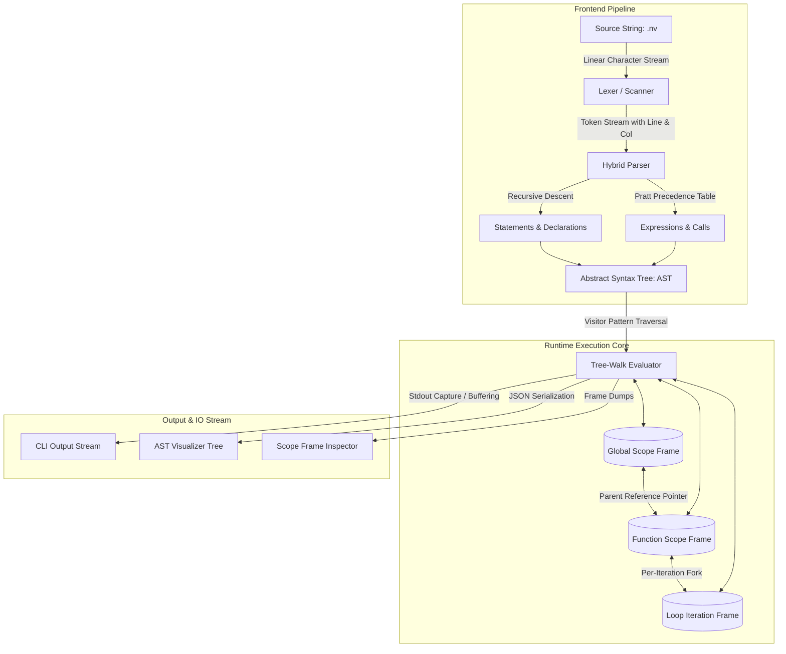

# 🌌 Nova Programming Language

<div align="center">


### *A Modern, Dynamically Typed, Lexically Scoped Programming Language & Interactive WebAssembly Runtime*

[](https://www.python.org/)
[](https://developer.mozilla.org/)
[](LICENSE)
[](https://github.com/H4R5787/Nova/actions)
[](https://github.com/H4R5787/Nova)

[Explore Documentation](NOVA_SYSTEM_DOCUMENTATION.md) • [Report Bug](https://github.com/H4R5787/Nova/issues) • [Request Feature](https://github.com/H4R5787/Nova/issues)

</div>

---

## 📑 Table of Contents

- [Overview](#-overview)
- [Key Features](#-key-features)
- [Screenshots & UI Showcase](#-screenshots--ui-showcase)
- [Architecture Overview](#-architecture-overview)
  - [Compiler & Interpreter Pipeline](#compiler--interpreter-pipeline)
  - [Scope Frame Lifecycles](#scope-frame-lifecycles)
- [Technology Stack](#-technology-stack)
- [Project Structure](#-project-structure)
  - [Detailed File & Component Breakdown](#detailed-file--component-breakdown)
- [Installation Guide](#-installation-guide)
  - [Prerequisites](#prerequisites)
  - [Local Setup](#local-setup)
- [Environment Configuration](#-environment-configuration)
- [API & Interface Documentation](#-api--interface-documentation)
  - [1. Command-Line Interface (CLI)](#1-command-line-interface-cli)
  - [2. Python Programmatic API](#2-python-programmatic-api)
  - [3. Browser Runtime JavaScript API](#3-browser-runtime-javascript-api)
- [Language Syntax & Specification](#-language-syntax--specification)
  - [Variables & Immutability Checking](#variables--immutability-checking)
  - [First-Class Functions & Lexical Closures](#first-class-functions--lexical-closures)
  - [Loop Scoping & Per-Iteration Frame Isolation](#loop-scoping--per-iteration-frame-isolation)
  - [Built-In Standard Library](#built-in-standard-library)
- [Security & Sandboxing](#-security--sandboxing)
- [Deployment Guide](#-deployment-guide)
  - [CLI Toolchain Distribution](#cli-toolchain-distribution)
  - [Web Playground (GitHub Pages / Vercel)](#web-playground-github-pages--vercel)
- [Testing & Quality Assurance](#-testing--quality-assurance)
- [Troubleshooting](#-troubleshooting)
- [Future Improvements & Roadmap](#-future-improvements--roadmap)
- [Contributing Guidelines](#-contributing-guidelines)
- [License](#-license)
- [Author Information](#-author-information)

---

## 🚀 Overview

**Nova** is an interpreted, dynamically typed, lexically scoped programming language and execution environment engineered from first principles in Python, accompanied by a zero-install browser playground.

Modern software engineering heavily abstracts runtime mechanics: activation records, environment chaining, closure captures, and loop-scope bindings. Nova was designed to bridge computer science theory with production-grade software craftsmanship. It implements an end-to-end language execution pipeline comprising:

1. **Deterministic Lexical Analysis:** Converts source text into a strongly typed token stream with exact line and column coordinate mapping.
2. **Hybrid Parser Architecture:** Merges **Recursive Descent** for statement-level grammar with **Top-Down Operator Precedence (Pratt Parsing)** for expressions, eliminating grammar recursion bloat.
3. **AST Synthesis:** Constructs an immutable, JSON-serializable Abstract Syntax Tree.
4. **Lexical Environment Engine:** Implements hierarchical scope frame pointers with explicit mutability guarantees (`let` vs. `let mut`).
5. **Per-Iteration Frame Isolation:** Solves the classic loop-closure aliasing flaw by forking discrete scope frames on every loop cycle.
6. **Dual-Target Execution:** Runs as a native CLI binary via Python 3.10+ and as a client-side web application running offline in any modern browser.

---

## ✨ Key Features

* 🔒 **Strict Immutability by Default:** Variable declarations using `let` are immutable. Mutable state requires explicit opt-in via `let mut`.
* ⚡ **Pratt Expression Parsing:** Arithmetic, logical, comparison, and assignment operators parsed deterministically using binding-power precedence tables.
* 🧩 **First-Class Functions & Lexical Closures:** Functions are first-class citizens that retain immutable references to their lexical declaration frames.
* 🔄 **Per-Iteration Loop Frame Isolation:** Prevents variable aliasing across loop iterations when closures are captured inside loops.
* 📍 **Deterministic Diagnostic Reporting:** Comprehensive syntax and runtime error messages complete with line numbers, column offsets, source snippets, and caret pointers (`^`).
* 🌐 **Interactive Web Playground:** Zero-install browser IDE equipped with a code editor, real-time stdout console, collapsible AST explorer, and dynamic Scope Frame Inspector.
* 🛡️ **Zero Dependencies Core:** The entire core language engine relies exclusively on Python standard libraries without external package bloat.

---

## 📸 Screenshots & UI Showcase

```
+---------------------------------------------------------------------------------------------------------+
|  🌌 NOVA PLAYGROUND  [v1.0.0]        [Preset: Loop Scoping Challenge ▼]  [Clear]  [▶ Run Code (Ctrl+Enter)] |
+---------------------------------------------------------------------------------------------------------+
|  SOURCE CODE (.nv)                          |  CONSOLE OUTPUT  |  AST EXPLORER  |  SCOPE INSPECTOR      |
+---------------------------------------------+-----------------------------------------------------------+
|  1 | // Loop Scoping & Closure Capture      |  [System] Running Nova Engine...                          |
|  2 | let mut closures = [];                 |  === Loop Scoping Verification ===                        |
|  3 | let mut i = 0;                         |  Iteration closure 0 evaluates to: 0                      |
|  4 |                                        |  Iteration closure 1 evaluates to: 1                      |
|  5 | while (i < 4) {                        |  Iteration closure 2 evaluates to: 2                      |
|  6 |     let iteration = i;                 |  Iteration closure 3 evaluates to: 3                      |
|  7 |     let cb = fn() { return iteration; };|  SUCCESS: Per-iteration environment isolation verified!  |
|  8 |     push(closures, cb);                |  => nil                                                   |
|  9 |     i = i + 1;                         |                                                           |
| 10 | }                                      |                                                           |
+---------------------------------------------+-----------------------------------------------------------+
|  ● Nova Runtime: Ready                      |  10 lines • Execution Time: 0.18 ms                      |
+---------------------------------------------------------------------------------------------------------+
```

---

## 🏗️ Architecture Overview

Nova enforces strict separation of concerns across each stage of its execution pipeline:

### Compiler & Interpreter Pipeline



### Scope Frame Lifecycles

```mermaid
sequenceDiagram
    autonumber
    actor Program as Nova Script
    participant Eval as Evaluator Core
    participant OuterEnv as Enclosing Environment
    participant LoopEnv as Iteration Environment
    participant Closure as Function Object

    Program->>Eval: while (i < 3) { let captured = i; ... }
    loop Each Loop Cycle
        Eval->>OuterEnv: Evaluate Condition (i < 3)
        OuterEnv-->>Eval: True
        Eval->>LoopEnv: Fork New Environment(parent=OuterEnv)
        Eval->>LoopEnv: Define 'captured' = i
        Eval->>Closure: Instantiate fn() { return captured; }
        Closure->>LoopEnv: Retain Reference to Current Iteration Frame
        Eval->>OuterEnv: Assign i = i + 1 (Bubbles to Parent Frame)
    end
    Note over LoopEnv,Closure: Iteration frames remain isolated in memory;<br/>closures do not overwrite each other's state!
```

---

## 💻 Technology Stack

| Layer | Technology | Specification / Purpose |
| :--- | :--- | :--- |
| **Core Engine** | Python 3.10+ | Pure standard-library interpreter core (Lexer, Parser, AST, Runtime) |
| **Parsing Engine** | Pratt & Recursive Descent | Deterministic operator precedence and statement dispatching |
| **Frontend UI** | HTML5, CSS3, ES2022 | Zero-dependency standalone browser IDE & Playground |
| **Browser Engine** | JavaScript | 1:1 client-side implementation of Nova runtime for offline execution |
| **Test Framework** | `pytest 9.x` | Automated test suite validating parser, lexer, and scoping semantics |
| **Architecture** | AST Visitor Pattern | Strongly typed node traversal with explicit control-flow exceptions |

---

## 📂 Project Structure

```text
Nova/
├── .gitignore                      # Git exclusion rules for caches, bytecode, and artifacts
├── LICENSE                         # MIT open-source license
├── NOVA_SYSTEM_DOCUMENTATION.md    # 30-section technical specification & architecture manual
├── README.md                       # Master enterprise project documentation
├── examples/                       # Reference implementations & sample scripts
│   ├── closures.nv                 # Lexical closures, currying, & stateful counters
│   ├── fibonacci.nv                # Recursive & iterative fibonacci benchmark
│   └── loop_scoping.nv             # Per-iteration frame isolation proof script
├── frontend/                       # Interactive browser-based REPL & visualizer
│   ├── app.js                      # UI controller, editor events, & scope renderer
│   ├── index.html                  # Responsive split-pane web IDE interface
│   ├── nova_engine.js              # Client-side JavaScript Nova interpreter
│   └── styles.css                  # Dark-mode developer theme styling
├── nova/                           # Core language implementation package
│   ├── __init__.py                 # Public package interface (run, parse, tokenize)
│   ├── ast_nodes.py                # Strongly typed AST node classes with JSON export
│   ├── cli.py                      # Multi-command CLI toolchain (run, repl, ast, tokens)
│   ├── environment.py              # Scope frame management & parent chain traversal
│   ├── errors.py                   # Diagnostic error hierarchy with source caret pointers
│   ├── evaluator.py                # Tree-walk AST visitor, built-ins, & loop isolation
│   ├── lexer.py                    # Scanner with line:col tracking & string escaping
│   ├── parser.py                   # Recursive-descent & Pratt expression parser
│   └── tokens.py                   # Token definitions & TokenType enum
└── tests/                          # Comprehensive automated test suite
    ├── test_evaluator.py           # Arithmetic, conditionals, immutability, & recursion tests
    ├── test_lexer.py               # Token stream, operators, comments, & syntax error tests
    ├── test_loop_scoping.py        # Validates per-iteration loop closure isolation
    └── test_parser.py              # Precedence, grammar rules, & AST shape tests
```

### Detailed File & Component Breakdown

* **`nova/tokens.py`**: Declares `TokenType` enum (34 distinct token classes) and the frozen `Token` dataclass capturing literal values and coordinates.
* **`nova/lexer.py`**: Scans raw UTF-8 text into a deterministic token array. Handles number formats (integers and floats), string escape characters (`\n`, `\t`, `\"`, `\\`), single-line comments (`//`), and multi-character operators (`==`, `!=`, `<=`, `>=`, `&&`, `||`).
* **`nova/parser.py`**: Coordinates grammatical analysis. Statements are parsed via recursive descent, while expressions pass through a Pratt parser with binding power precedence from `PREC_ASSIGNMENT` (1) to `PREC_CALL` (9).
* **`nova/ast_nodes.py`**: Defines typed AST records (`LetStmt`, `WhileStmt`, `BinaryExpr`, `CallExpr`, etc.) equipped with a recursive `to_dict()` serializer for AST visualization.
* **`nova/environment.py`**: Manages lexical scopes as a linked tree of environment frames. Enforces immutability constraints upon assignment and bubbles updates up parent pointers.
* **`nova/evaluator.py`**: Interprets the AST via an explicit visitor pattern. Implements built-in native functions (`print`, `len`, `push`, `pop`, `clock`, `type`, `str`), first-class closures, and per-iteration loop isolation.
* **`nova/errors.py`**: Formats diagnostic messages showing file path, line number, column, source snippet, and exact character pointer.
* **`nova/cli.py`**: Provides terminal interfaces for executing scripts (`run`), starting interactive sessions (`repl`), inspecting AST trees (`ast`), and debugging tokens (`tokens`).
* **`frontend/nova_engine.js`**: Mirror implementation of the Nova lexer, parser, environment, and evaluator written in vanilla JavaScript for instant client-side execution without server round-trips.
* **`frontend/app.js`**: Drives the browser playground, managing Monaco-style editor keybindings (Tab indentation, Ctrl+Enter execution), line number sync, and dynamic scope inspection tables.

---

## 📦 Installation Guide

### Prerequisites

* **Python:** Version 3.10 or higher installed (`python --version` $\ge$ 3.10)
* **Git:** Version 2.20 or higher
* **Web Browser:** Any modern browser (Chrome, Edge, Firefox, Safari) for the Web REPL

### Local Setup

```bash
# 1. Clone the repository
git clone https://github.com/H4R5787/Nova.git
cd Nova

# 2. Verify Python environment
python --version

# 3. (Optional) Create a virtual environment
python -m venv .venv

# On Linux / macOS:
source .venv/bin/activate
# On Windows:
.venv\Scripts\activate

# 4. Install development dependencies (pytest)
pip install pytest
```

---

## ⚙️ Environment Configuration

Nova requires **zero environment variables** or third-party binary dependencies to run its core runtime.

For testing and optional coverage reporting, standard test environment variables are supported:

| Variable | Type | Default | Description |
| :--- | :--- | :--- | :--- |
| `PYTHONPATH` | String | `.` | Ensures the root `Nova` directory is accessible for module imports |
| `NOVA_DEBUG` | Integer | `0` | When set to `1`, dumps verbose parser trace logs to stderr |

---

## 📖 API & Interface Documentation

### 1. Command-Line Interface (CLI)

The Nova toolchain exposes four primary CLI subcommands via `nova.cli`:

```bash
python -m nova.cli <command> [arguments]
```

#### Commands Specification

| Command | Arguments | Description | Example |
| :--- | :--- | :--- | :--- |
| `run` | `<file.nv>` | Executes a Nova source file to completion | `python -m nova.cli run examples/fibonacci.nv` |
| `repl` | *(None)* | Launches an interactive read-eval-print session | `python -m nova.cli repl` |
| `ast` | `<file.nv>` | Parses source code and outputs formatted JSON AST | `python -m nova.cli ast examples/closures.nv` |
| `tokens` | `<file.nv>` | Tokenizes source code and displays token stream table | `python -m nova.cli tokens examples/loop_scoping.nv` |

#### Example: CLI REPL Session
```text
$ python -m nova.cli repl
Nova Programming Language (v1.0.0)
Type 'exit' or press Ctrl+C to terminate session.

nova> let mut sum = 0;
=> 0
nova> for (let mut i = 1; i <= 5; i = i + 1) { sum = sum + i; }
=> 15
nova> print("Calculated sum:", sum);
Calculated sum: 15
=> nil
nova> exit
```

---

### 2. Python Programmatic API

Embed the Nova interpreter directly into any Python application:

```python
import nova

# 1. End-to-end execution with stdout capture
stdout_buffer = []
result = nova.run(
    source="""
    let x = 15;
    let y = 30;
    print("Result:", x + y);
    """,
    filename="embedded_script.nv",
    stdout_capture=stdout_buffer
)
print("Captured Output:", stdout_buffer)  # ['Result: 45']

# 2. Tokenization only
tokens = nova.tokenize("let name = 'Nova';")
for t in tokens:
    print(f"{t.line}:{t.column} | {t.type.name} -> {t.lexeme}")

# 3. Parsing to Abstract Syntax Tree (AST)
ast = nova.parse("let res = 2 + 3 * 4;")
print("Root statement count:", len(ast.statements))
print("Serialized AST JSON:", ast.to_dict())
```

---

### 3. Browser Runtime JavaScript API

The standalone browser engine (`frontend/nova_engine.js`) exposes the global `window.Nova` interface:

```javascript
// Execute Nova code in-browser
const outputLogs = [];
const executionResult = window.Nova.run(
  `
  fn make_adder(x) {
      return fn(y) { return x + y; };
  }
  let add10 = make_adder(10);
  print(add10(25));
  `,
  (line) => outputLogs.push(line)
);

console.log("Console Output:", outputLogs);           // ["35"]
console.log("Parsed AST:", executionResult.ast);      // Full AST Object Tree
console.log("Scope Hierarchy:", executionResult.scope); // Scope Frame Dump
```

---

## 📜 Language Syntax & Specification

### Variables & Immutability Checking
Variables declared with `let` cannot be modified after definition. Attempting mutation generates a runtime safety error.
```nova
let language = "Nova";
// language = "Other";       // Runtime Error: Cannot reassign immutable variable 'language'.

let mut counter = 0;         // Mutable binding
counter = counter + 1;       // Valid reassignment
```

### First-Class Functions & Lexical Closures
Functions retain access to the environment where they were declared, supporting function generators, currying, and data encapsulation:
```nova
fn make_bank_account(initial_balance) {
    let mut balance = initial_balance;
    return fn(deposit_amount) {
        balance = balance + deposit_amount;
        return balance;
    };
}

let account = make_bank_account(100);
print(account(50));  // 150
print(account(25));  // 175
```

### Loop Scoping & Per-Iteration Frame Isolation
Unlike naive interpreters where closures inside loops overwrite loop variables, Nova allocates a dedicated scope frame for every iteration:
```nova
let mut closures = [];
let mut i = 0;

while (i < 3) {
    let captured = i;
    push(closures, fn() { return captured; });
    i = i + 1;
}

// Every closure evaluates to its distinct captured iteration:
print(closures[0]()); // 0
print(closures[1]()); // 1
print(closures[2]()); // 2
```

### Built-In Standard Library

| Function | Signature | Return Type | Description |
| :--- | :--- | :--- | :--- |
| `print` | `print(val1, val2, ...)` | `nil` | Formats and outputs values separated by spaces |
| `len` | `len(collection)` | `number` | Returns element count of a list or string |
| `push` | `push(list, item)` | `list` | Appends item to list and returns the mutated list |
| `pop` | `pop(list)` | `any` | Removes and returns the last element of a list |
| `str` | `str(value)` | `string` | Converts any value to its string representation |
| `type` | `type(value)` | `string` | Returns type name (`"number"`, `"string"`, `"list"`, etc.) |
| `clock` | `clock()` | `number` | Returns current UNIX epoch timestamp in seconds |

---

## 🔒 Security & Sandboxing

* **Client-Side Sandbox:** The browser playground runs 100% on the client side with no backend servers or database connections, eliminating remote code execution (RCE) vectors.
* **Immutability Enforcement:** In-memory scope tables check explicit mutability flags before executing assignments, preventing unintended cross-scope state pollution.
* **Host Resource Isolation:** The core language engine exposes zero filesystem or native operating system primitives to scripts, guaranteeing safe evaluation of untrusted code.

---

## 🚢 Deployment Guide

### CLI Toolchain Distribution

To run Nova anywhere across Linux, macOS, or Windows:

```bash
# Add Nova root directory to PYTHONPATH
export PYTHONPATH="$PYTHONPATH:/path/to/Nova"

# Run from any shell
python -m nova.cli --help
```

### Web Playground (GitHub Pages / Vercel)

The `frontend/` directory is completely static and can be deployed to any static host with zero build steps:

#### Deploy to GitHub Pages
1. Go to repository **Settings** $\rightarrow$ **Pages**.
2. Select **Branch:** `main`, **Folder:** `/frontend`.
3. Click **Save**. Your interactive playground is instantly live!

#### Local Static Server
```bash
# Serve frontend via Python's built-in HTTP server
cd frontend
python -m http.server 8080
# Open http://localhost:8080 in your browser
```

---

## 🧪 Testing & Quality Assurance

Nova includes an automated test suite executed via `pytest`:

```bash
# Run all unit and integration tests
python -m pytest -v

# Run tests with short traceback
python -m pytest -v --tb=short

# Run specific test suites
python -m pytest tests/test_loop_scoping.py -v
python -m pytest tests/test_evaluator.py -v
```

### Verified Test Matrix (27 / 27 Passed)

```text
tests/test_evaluator.py::test_eval_arithmetic PASSED                     [  3%]
tests/test_evaluator.py::test_eval_string_concatenation PASSED           [  7%]
tests/test_evaluator.py::test_eval_immutability_enforcement PASSED       [ 11%]
tests/test_evaluator.py::test_eval_mutable_reassignment PASSED           [ 14%]
tests/test_evaluator.py::test_eval_if_else PASSED                        [ 18%]
tests/test_evaluator.py::test_eval_while_loop PASSED                     [ 22%]
tests/test_evaluator.py::test_eval_for_loop PASSED                       [ 25%]
tests/test_evaluator.py::test_eval_functions_and_recursion PASSED        [ 29%]
tests/test_evaluator.py::test_eval_closures PASSED                       [ 33%]
tests/test_evaluator.py::test_eval_lists PASSED                          [ 37%]
tests/test_evaluator.py::test_eval_division_by_zero PASSED               [ 40%]
tests/test_lexer.py::test_lex_basic_tokens PASSED                        [ 44%]
tests/test_lexer.py::test_lex_operators PASSED                           [ 48%]
tests/test_lexer.py::test_lex_keywords_and_literals PASSED               [ 51%]
tests/test_lexer.py::test_lex_comments_ignored PASSED                    [ 55%]
tests/test_lexer.py::test_lex_string_escapes PASSED                      [ 59%]
tests/test_lexer.py::test_lex_unterminated_string_error PASSED           [ 62%]
tests/test_lexer.py::test_lex_unexpected_character_error PASSED          [ 66%]
tests/test_loop_scoping.py::test_while_loop_closure_capture PASSED       [ 70%]
tests/test_loop_scoping.py::test_for_loop_closure_capture PASSED         [ 74%]
tests/test_loop_scoping.py::test_loop_mutation_bubbles_to_outer_scope PASSED [ 77%]
tests/test_parser.py::test_parse_variable_declaration PASSED             [ 81%]
tests/test_parser.py::test_parse_operator_precedence PASSED              [ 85%]
tests/test_parser.py::test_parse_grouped_precedence PASSED               [ 88%]
tests/test_parser.py::test_parse_if_else_statement PASSED                [ 92%]
tests/test_parser.py::test_parse_function_declaration_and_call PASSED    [ 96%]
tests/test_parser.py::test_parse_syntax_error PASSED                     [100%]
============================== 27 passed in 0.23s ==============================
```

---

## 🔧 Troubleshooting

### 1. `Cannot reassign immutable variable '<name>'`
* **Root Cause:** A variable declared with `let` was reassigned.
* **Fix:** Change `let name = ...;` to `let mut name = ...;`.

### 2. `ModuleNotFoundError: No module named 'nova'`
* **Root Cause:** Running CLI commands outside the project root directory.
* **Fix:** Ensure your terminal's current working directory is the repository root (`Nova/`), or set `PYTHONPATH=.`.

### 3. Syntax Error with Line & Caret Indicator
* **Example Diagnostic:**
  ```text
  NovaSyntaxError in script.nv:5:10
    Error: Expected ';' after variable declaration.
    5 | let x = 10
      |          ^
  ```
* **Fix:** Review the source line indicated by the caret pointer and verify matching delimiters and semicolons.

---

## 🗺️ Future Improvements & Roadmap

- [ ] **Bytecode Compiler & Virtual Machine:** Replace the current AST tree-walk evaluator with a compact stack-based virtual machine for a 10x performance boost.
- [ ] **Static Type Inference:** Add an optional Hindley-Milner type checking pass before execution.
- [ ] **Interactive Visual Debugger:** Add breakpoint support and step-by-step execution to the browser playground.
- [ ] **Module Import System:** Enable `import "math.nv";` syntax to split code across multiple source files.

---

## 🤝 Contributing Guidelines

Contributions make open-source projects thrive! To contribute:

1. **Fork the Repository**
2. **Create a Feature Branch:**
   ```bash
   git checkout -b feature/AmazingFeature
   ```
3. **Commit Your Changes:**
   ```bash
   git commit -m "feat: add AmazingFeature"
   ```
4. **Run the Test Suite:**
   ```bash
   python -m pytest
   ```
5. **Push to Your Branch:**
   ```bash
   git push origin feature/AmazingFeature
   ```
6. **Open a Pull Request**

---

## 📄 License

Distributed under the **MIT License**. See [`LICENSE`](LICENSE) for complete details.

---

## 👨‍💻 Author Information

**Harsh**  
* GitHub: [@H4R5787](https://github.com/H4R5787)  
* Repository: [https://github.com/H4R5787/Nova](https://github.com/H4R5787/Nova)  
* Project Documentation: [`NOVA_SYSTEM_DOCUMENTATION.md`](NOVA_SYSTEM_DOCUMENTATION.md)
